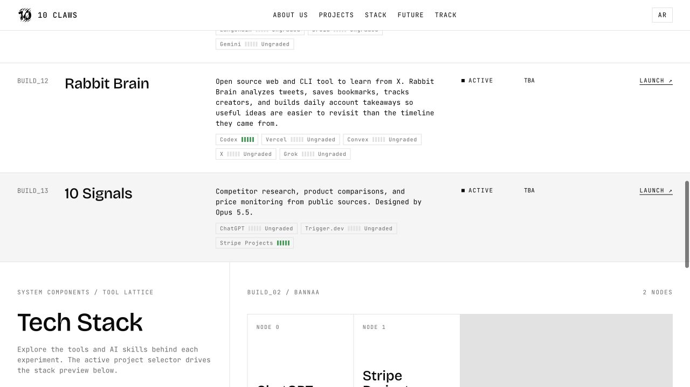
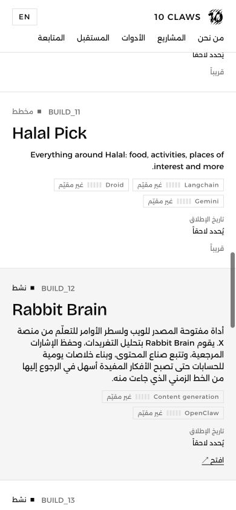

# Project launch dates — 30 September 2026

Project summaries now show launch dates instead of completion percentages and progress bars. The admin project editor accepts an optional calendar date; clearing it shows TBA (Arabic: يُحدد لاحقاً). Existing project percentages and monthly metrics remain stored, and existing projects were not assigned inferred launch dates.

Validation:

- `pnpm lint` and `pnpm exec tsc --noEmit` passed.
- `pnpm build` and the production Vercel build passed.
- `node --test tests/launch-date.test.mjs tests/home-redesign.test.mjs`: 8 tests passed, including invalid calendar dates, leap days, unknown dates, and consistent formatting across timezones.
- Live English desktop and Arabic mobile (390px) show launch-date cells without project progress bars or horizontal overflow.
- Production Convex contains 10 Signals (BUILD_13), Active, using ChatGPT, Trigger.dev, and Stripe Projects, with the Opus 5.5 design credit. Its launch date is unset. All ten pre-existing project query results were unchanged by this insertion.
- Temporary insertion helper removed and backend redeployed.
- Authenticated admin form submission was not exercised because the browser session was signed out; field plumbing and backend validation passed type checks and review.

