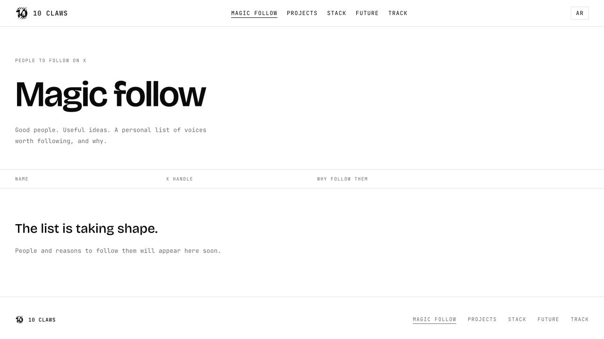
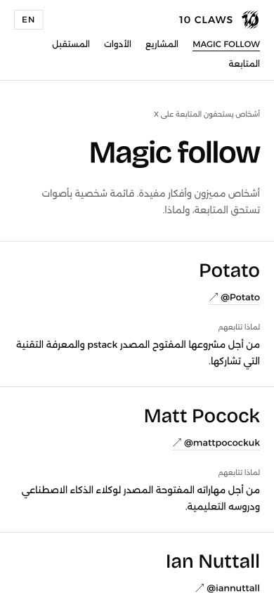

# Magic follow

Replaces the About Us page with a curated X directory: name, linked handle, and a reason to follow each person. English and Arabic content lives in `lib/magic-follow/content.ts`. The eleven owner-supplied accounts appear in the supplied order, with lightly edited English reasons and Arabic translations preserving the personal tone.

The former About content and FormSubmit enquiry form are removed. Homepage and shared public navigation now link to Magic follow. Both localized About URLs redirect permanently (308), and the sitemap lists the new routes.

Validation: lint, TypeScript, and production builds pass. Redirect status and destinations checked for both languages; sitemap checked for the replacement URLs. The original empty state was verified before the owner supplied the list.

The populated production page was checked on 30 September 2026: all eleven rows and exact supplied X handles are present in order. English desktop and Arabic mobile (390px) render without horizontal overflow; screenshots below show the populated directory.

Names were checked against public profiles and personal sites, including [Matt Pocock](https://github.com/mattpocock), [Ian Nuttall](https://ian.is/), [Kun Chen](https://github.com/kunchenguid), [Mario Zechner](https://huggingface.co/badlogicgames), [Ahmad Osman](https://theahmadosman.world/), [Steve Sewell](https://github.com/steve8708), [Dan McAteer](https://x.com/daniel_mac8/status/2015424424863003135), [Trevin Chow](https://trev.in/), and [Kieran Klaassen](https://github.com/kieranklaassen). Potato retains the supplied public alias; direct X profile fetches were unavailable. Quinn Slack (@sqs) was added with the owner's Amp recommendation; his name and handle are confirmed by [Amp's profile](https://ampcode.com/docs/using-amp/quinn). Reasons are the owner's recommendations.

