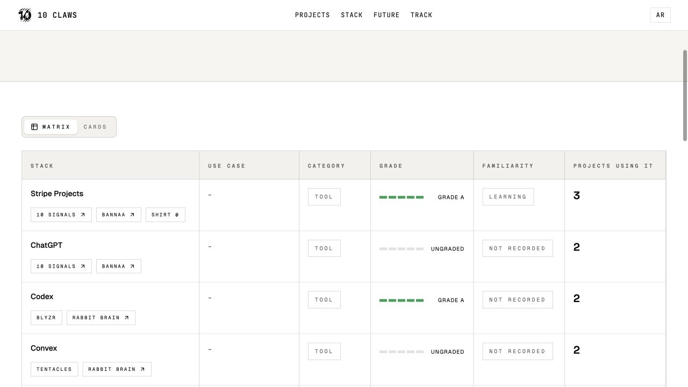
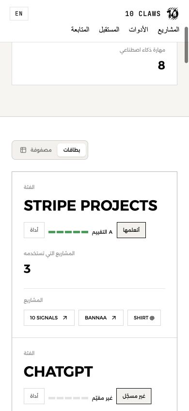

# Stack inventory and shared navigation

The public Stack page previously listed six catalog records with zero usage because project assignments used legacy tool/skill names instead of catalog IDs. It now builds an inventory from canonical project data, enriching matching names or linked IDs with catalog metadata. English and Arabic use the same assignments. Usage counts unique projects, duplicate casing is merged, and unknown grades/familiarity are not inferred. Unassigned catalog records remain unchanged in the backend.

Verified production data before deployment: 22 assigned entries (14 tools, 8 AI skills). Stripe Projects has three projects; ChatGPT and Codex each have two; Trigger.dev links to 10 Signals. The homepage tool count uses the same deduplication.

All public routes share the homepage header component and styling: 28px logo, Projects, Stack, Future, Track, route-preserving AR/EN toggle, and wrapping mobile navigation. The extra Progress header button is removed. Magic follow remains in footer navigation. Stack now opens `/stack` from every header.

Validation:

- 14 launch-date/homepage tests passed, including new inventory tests for legacy names, catalog IDs, duplicate assignments, category boundaries, missing metadata, and safe project URLs.
- Lint and TypeScript passed.
- Local English matrix and card views render all 22 entries with accurate project links and five-segment grades.
- Arabic mobile (390px) checks covered homepage, Stack, Future, Track, Progress, and Magic follow: matching menu labels, destinations, font, and 28px logo; no document overflow.
- Production build passed and deployed. Live English matrix and Arabic cards each contain 22 entries with correct usage counts. AR toggle retained `/stack`, both views have no document overflow, and the live homepage shows 14 tools with Magic follow still in the footer.

